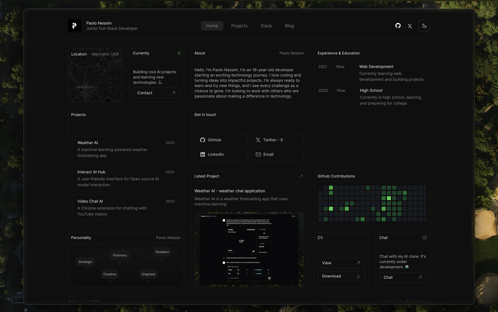

<h1 align="center">My Portfolio</h1>

<p align="center" style="padding: 20px 0 ;">
✨ My Portfolio built with Next.js and Shadcn UI ✨
</p>

<p align="center">
  <a href="#features"><strong>Features</strong></a> ·
  <a href="#running-locally"><strong>Running locally</strong></a>.
  <a href="#acknowledgments"><strong>Acknowledgments</strong></a>
</p>
<br/>

## Features

- [Next.js](https://nextjs.org) App Router
- React Server Components (RSCs), Suspense, and Server Actions
- [Vercel AI SDK](https://sdk.vercel.ai/docs) for streaming chat UI
- [shadcn/ui](https://ui.shadcn.com)
  - Styling with [Tailwind CSS](https://tailwindcss.com)
  - [Radix UI](https://radix-ui.com) for headless component primitives
  - Icons from [Phosphor Icons](https://phosphoricons.com)

## Running locally

```bash
git clone https://github.com/PaoloJN/paolonessim.com
cd paolonessim.com
```

```bash
pnpm install
pnpm dev
```

Should now be running on [localhost:3000](http://localhost:3000/).

## Acknowledgments

This woun't be possible without the following resources:

- [FF-Widgets Template](https://ff-widgets.framer.website/light)
